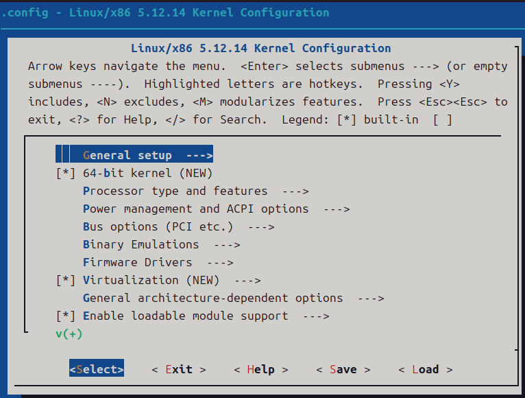
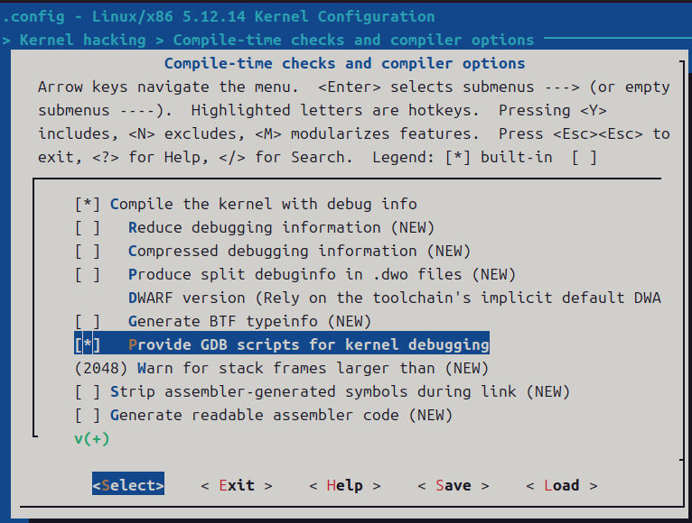

# 1. 调试环境

使用Docker构建Linux Kernel的运行及调试环境

## 1.1. 构建Docker镜像

通过Docker，并基于busybox, qemu-kvm以及gdb等工具构建一个编译、运行、调试Linux Kernel的容器环境。
需要一个能够编译 Linux Kernel 的 Docker 镜像。新建目录 $HOME/linux_docker:
在该目录下创建文件 build-kernel.sh 并写入如下内容：

```bash```
#!/bin/bash

cd /workspace/linux-5.12.14
make O=../obj/linux/ -j$(nproc)
```
该文件用来编译内核

创建文件 start-gdb.sh 并写入如下内容：

```bash
#!/bin/bash

echo 'add-auto-load-safe-path /workspace/linux-5.12.14/scripts/gdb/vmlinux-gdb.py' > /root/.gdbinit # 让 gdb 能够顺利加载内核的调试脚本，如果在下一节编译 Linux Kernel 时下载的是另一版本的 Linux Kernel 代码，请修改这里的版本号
cd /workspace/obj/linux/
gdb vmlinux -ex "target remote :1234" # 启动 gdb 远程调试内核
```
该文件用于调试 Linux Kernel 时进入 GDB 调试器

另外再创建文件 Dockerfile 并写入如下内容：

```bash
FROM docker.m.daocloud.io/library/debian:10.8-slim

RUN apt-get update
RUN apt install -y apt-transport-https ca-certificates \
    && echo 'deb https://mirrors.tuna.tsinghua.edu.cn/debian/ buster main contrib non-free \n\
    deb https://mirrors.tuna.tsinghua.edu.cn/debian/ buster-updates main contrib non-free \n\
    deb https://mirrors.tuna.tsinghua.edu.cn/debian/ buster-backports main contrib non-free \n\
    deb https://mirrors.tuna.tsinghua.edu.cn/debian-security buster/updates main contrib non-free\n'\
    > /etc/apt/sources.list \
    && apt update && apt-get install -y \
    bc \
    bison \
    build-essential \
    cpio \
    flex \
    libelf-dev \
    libncurses-dev \
    libssl-dev \
    vim-tiny \
    qemu-kvm \
    gdb
ADD ./start-gdb.sh /usr/local/bin
ADD ./build-kernel.sh /usr/local/bin
RUN chmod a+x /usr/local/bin/*.sh
WORKDIR /workspace
```

构建镜像：

```bash
docker build -t linux-builder .
```

## 1.2. 编译 Linux Kernel

### 1.2.1. 下载 Linux Kernel 源码

下载最新稳定版 Linux Kernel 源码：
```bash
cd $HOME/linux/
wget https://cdn.kernel.org/pub/linux/kernel/v5.x/linux-5.12.14.tar.xz
tar -xvJf linux-5.12.14.tar.xz
```

创建编译结果目录：

```bash
mkdir -p $HOME/linux_docker/obj/linux
```

进入目录 $HOME/linux/ 并运行如下命令，进入容器编译内核：

```bash
docker run -it --name linux-builder -v $HOME/linux:/workspace linux-builder
```

在容器内进入解压后内核源代码目录，并配置 Kernel 的编译选项：

```bash
cd /workspace/linux-5.12.14
make O=../obj/linux menuconfig
```

该命令会打开一个基于命令行的配置页面，如下图所示：



我们需要将调试信息编译至内核文件中，导航至 Kernel hacking -> Compile-time checks and compiler options，并选中如下选项：



保存并退出。此时的配置信息写入到了文件 /workspace/obj/linux/.config, 也可以直接修改该文件来完成配置。例如此处我们勾选的编译选项对应的配置项为：

```bash
CONFIG_DEBUG_INFO=y
CONFIG_GDB_SCRIPTS=y
```

选中 CONFIG_GDB_SCRIPTS 是为了调试时能够使用内核代码中提供的 gdb 脚本，gdb 支持使用 python 来扩展命令，内核代码中提供的脚本在目录 $HOME/linux/linux-5.12.14/scripts/gdb 中。