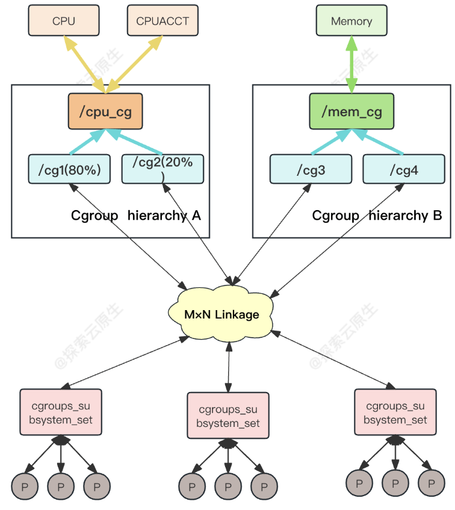

# Linux Cgroups：资源控制的奇妙世界

## 1. 什么是 Cgroups

Cgroups 是 Linux 下的一种将进程按组进行管理的机制，它提供了对一组进程及将来子进程的资源限制控制和统计的能力。

这些资源包括 CPU、内存、存储、网络等。通过 Cgroups 可以方便地限制某个进程的资源占用，并且可以实时地监控进程的监控与统计信息

Cgroups 分 v1 和 v2 两个版本：

- v1 实现较早，功能比较多，但是由于它里面的功能都是零零散散的实现的，所以规划的不是很好，导致了一些使用和维护上的不便。
- v2 的出现就是为了解决 v1 的问题，在最新的 4.5 内核中，Cgroups v2 声称已经可以用于生产环境了，但它所支持的功能还很有限。

### 1.1 三部分组件

Cgroups 主要包括下面几部分：

- **cgoups本身**：cgroup 是对进程分组管理的一种机制，一个 cgroup 包含一组进程，并可以在这个 cgroup 上增加 Linux subsystem 的各种参数配置，将一组进程和一组 subsystem 的系统参数关联起来。

- **subsystem**： 一个 subsystem 就是一个内核模块，他被关联到一颗 cgroup 树之后，就会在树的每个节点（进程组）上做具体的操作。subsystem 经常被称作"resource controller"，因为它主要被用来调度或者限制每个进程组的资源，但是这个说法不完全准确，因为有时我们将进程分组只是为了做一些监控，观察一下他们的状态，比如 perf_event subsystem。到目前为止，Linux 支持 12 种 subsystem，比如限制 CPU 的使用时间，限制使用的内存，统计 CPU 的使用情况，冻结和恢复一组进程等，后续会对它们一一进行介绍。

- **hierarchy**：一个 hierarchy 可以理解为一棵 cgroup 树，树的每个节点就是一个进程组，每棵树都会与零到多个 subsystem 关联。在一颗树里面，会包含 Linux 系统中的所有进程，但每个进程只能属于一个节点（进程组）。系统中可以有很多颗 cgroup 树，每棵树都和不同的 subsystem 关联，一个进程可以属于多颗树，即一个进程可以属于多个进程组，只是这些进程组和不同的 subsystem 关联。目前 Linux 支持 12 种 subsystem，如果不考虑不与任何 subsystem 关联的情况（systemd 就属于这种情况），Linux 里面最多可以建 12 颗 cgroup 树，每棵树关联一个 subsystem，当然也可以只建一棵树，然后让这棵树关联所有的 subsystem。当一颗 cgroup 树不和任何 subsystem 关联的时候，意味着这棵树只是将进程进行分组，至于要在分组的基础上做些什么，将由应用程序自己决定，systemd 就是一个这样的例子。

**3 个部分间的关系**

- 系统在创建了新的 hierarchy 之后,系统中所有的进程都会加入这个 hierarchy 的 cgroup 根节点,这个 cgroup 根节点是 hierarchy 默认创建的。
- 一个 subsystem 只能附加到 一 个 hierarchy 上面。
- 一个 hierarchy 可以附加多个 subsystem 。
- 一个进程可以作为多个 cgroup 的成员,但是这些 cgroup 必须在不同的 hierarchy 中。
- 一个进程 fork 出子进程时,子进程是和父进程在同一个 cgroup 中的,也可以根据需要将其移动到其他 cgroup 中。

### 1.2. 具体架构

这部分内容参考：[美团技术团队](https://tech.meituan.com/2015/03/31/cgroups.html)

hierarchy、cgroup、subsystem 3 者的关系：



比如上图表示两个 hierarchiy，每一个 hierarchiy 中是一颗树形结构，树的每一个节点是一个 cgroup （比如 cpu_cgrp, memory_cgrp)。

- 第一个 hierarchiy attach 了 cpu 子系统和 cpuacct 子系统， 因此当前 hierarchiy 中的 cgroup 就可以对 cpu 的资源进行限制，并且对进程的 cpu 使用情况进行统计

- 第二个 hierarchiy attach 了 memory 子系统，因此当前 hierarchiy 中的 cgroup 就可以对内存的资源进行限制

在每一个 hierarchiy 中，每一个节点（cgroup）可以设置对资源不同的限制权重（即自定义配置）。比如上图中 cgrp1 组中的进程可以使用 80%的 cpu 时间片，而 cgrp2 组中的进程可以使用 20%的 cpu 时间片。

cgroups 和 进程间的关系：

上面这个图从整体结构上描述了进程与 cgroups 之间的关系。最下面的P代表一个进程。

- 每一个进程的描述符中有一个指针指向了一个辅助数据结构css_set（cgroups subsystem set）。 指向某一个css_set的进程会被加入到当前css_set的进程链表中。一个进程只能隶属于一个css_set，一个css_set可以包含多个进程，隶属于同一css_set的进程受到同一个css_set所关联的资源限制。

- 上图中的”M×N Linkage”说明的是css_set通过辅助数据结构可以与 cgroups 节点进行多对多的关联。但是 cgroups 的实现不允许css_set同时关联同一个 cgroups 层级结构下多个节点。 这是因为 cgroups 对同一种资源不允许有多个限制配置。

- 一个css_set关联多个 cgroups 层级结构的节点时，表明需要对当前css_set下的进程进行多种资源的控制。而一个 cgroups 节点关联多个css_set时，表明多个css_set下的进程列表受到同一份资源的相同限制.

一个节点的控制列表中的所有进程都会受到当前节点的资源限制。同时某一个进程也可以被加入到不同的 cgroups 层级结构的节点中，因为不同的 cgroups 层级结构可以负责不同的系统资源。所以说进程和 cgroup 结构体是一个多对多的关系。

## 2. Cgroups 的使用

注：本文所有操作在 Ubuntu24.04 下进行。

cgroup 相关的所有操作都是基于内核中的 cgroup virtual filesystem，使用 cgroup 很简单，挂载这个文件系统就可以了。

一般情况下都是挂载到/sys/fs/cgroup 目录下，当然挂载到其它任何目录都没关系。

cgroups 以文件的方式提供应用接口，我们可以通过 mount 命令来查看 cgroups 默认的挂载点：

```bash
$ mount | grep cgroup
cgroup2 on /sys/fs/cgroup type cgroup2 (rw,nosuid,nodev,noexec,relatime,nsdelegate,memory_recursiveprot)
```

cgroup v2 相对于 cgroup v1 进行了重构，简化了控制接口，提供了更好的层级结构管理和性能表现。在 cgroup v1 中，不同的控制器（如 CPU、内存、I/O 等）是独立的，使用不同的子系统进行管理。而在 cgroup v2 中，所有的控制器通过一个统一的层次结构进行管理。

### 2.1. 查看subsystem列表

可以通过查看/proc/cgroups(since Linux 2.6.24)知道当前系统支持哪些 subsystem，下面是一个例子：

```bash
cat /proc/cgroups
#subsys_name	hierarchy	num_cgroups	enabled
cpuset	0	258	1
cpu	0	258	1
cpuacct	0	258	1
blkio	0	258	1
memory	0	258	1
devices	0	258	1
freezer	0	258	1
net_cls	0	258	1
perf_event	0	258	1
net_prio	0	258	1
hugetlb	0	258	1
pids	0	258	1
rdma	0	258	1
misc	0	258	1
```

从左到右，字段的含义分别是：
1. subsys_name：subsystem 的名字
2. hierarchy：subsystem 所关联到的 cgroup 树的 ID，如果多个 subsystem 关联到同一颗 cgroup 树，那么他们的这个字段将一样，比如这里的 cpu 和 cpuacct 就一样，表示他们绑定到了同一颗树。如果出现下面的情况，这个字段将为 0：
    - 当前 subsystem 没有和任何 cgroup 树绑定
    - 当前 subsystem 已经和 cgroup v2 的树绑定
    - 当前 subsystem 没有被内核开启
3. num_cgroups：subsystem 所关联的 cgroup 树中进程组的个数，也即树上节点的个数
4. enabled：1 表示开启，0 表示没有被开启(可以通过设置内核的启动参数“cgroup_disable”来控制 subsystem 的开启).

### 2.2. hierarchy 相关操作

cgroup v2 中，所有的 cgroup 都是在一个统一的层次结构中进行管理的，这个层次结构被称为 hierarchy。每一个 hierarchy 都是一个独立的 cgroup 树，每一个 cgroup 都是这个树的一个节点。

[cgroupv1和cgroupv2区别](https://www.alibabacloud.com/help/zh/alinux/support/differences-between-cgroup-v1-and-cgroup-v2#ffc59ea386zcb)

