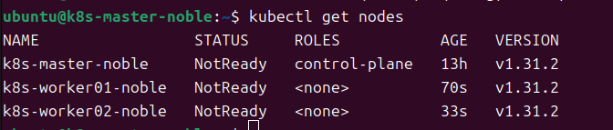
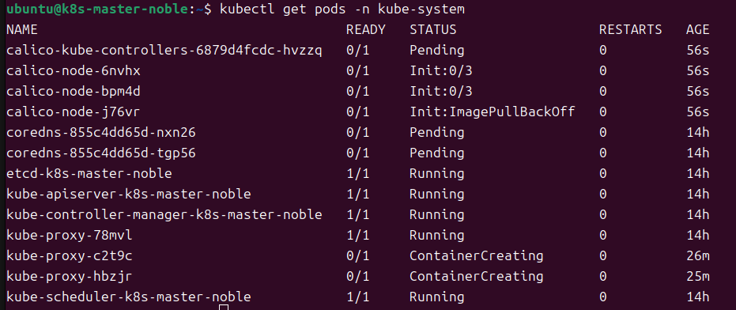

# Ubuntu安装kubernetes

https://www.cnblogs.com/ZXdeveloper/p/18322301
https://segmentfault.com/a/1190000045036296
https://blog.csdn.net/qq_33803102/article/details/142832084
https://blog.csdn.net/m0_51510236/article/details/141671652
https://www.cnblogs.com/fsdstudy/p/18355827
https://help.aliyun.com/zh/acr/user-guide/accelerate-the-pulls-of-docker-official-images#4766fe99e4g5f

## 系统环境

- Ubuntu 24.04
- Docker 27.3.1

## 部署

一共部署三台机器，IP：192.168.1.120、192.168.1.121、192.168.1.122 都是24.04的虚拟机
Instance 1 : Master Node (k8s-master-noble 192.168.1.120)
Instance 2 : Worker Node (k8s-worker01-noble 192.168.1.121)
Instance 3 : Worker Node (k8s-worker02-noble 192.168.1.122)

### 创建三个虚拟机

```bash
multipass launch -n k8s-master-noble -c 2 -m 2G -d 20G
multipass launch -n k8s-worker01-noble -c 2 -m 2G -d 20G
multipass launch -n k8s-worker02-noble -c 2 -m 2G -d 20G
```

### 设置 Host Name 更新 hosts 文件

登录到各个主机，并使用 hostnamectl 命令设置它们各自的主机名。
```bash
multipass shell k8s-master-noble
multipass shell k8s-worker01-noble
multipass shell k8s-worker02-noble
```

```bash
$ sudo hostnamectl set-hostname "k8s-master-noble"      // Master Node
$ sudo hostnamectl set-hostname "k8s-worker01-noble"    // Worker Node 1
$ sudo hostnamectl set-hostname "k8s-worker02-noble"    // Worker Node 2
```

将以下行添加到每个实例上的 /etc/hosts 文件中。
```bash
192.168.1.120  k8s-master-noble
192.168.1.121  k8s-worker01-noble
192.168.1.122  k8s-worker02-noble
```

### 禁用swap，加载内核模块

在每个实例上运行以下命令来禁用交换空间，这样 Kubernetes 集群才能顺利工作。
```bash
$ sudo swapoff -a
$ sudo sed -i '/ swap / s/^\(.*\)$/#\1/g' /etc/fstab
```

使用 modprobe 命令加载以下内核模块。
```bash
$ sudo modprobe overlay
$ sudo modprobe br_netfilter
```

要永久加载这些模块，请创建包含以下内容的文件。
```bash
$ sudo tee /etc/modules-load.d/k8s.conf <<EOF
overlay
br_netfilter
EOF
```
运行以下命令，加载上述内核参数。
```bash
$ sudo sysctl --system
```

### 安装配置 Containerd

Containerd 为 Kubernetes 提供了容器运行时，在所有三个实例上安装 containerd
```bash
$ sudo apt install -y curl gnupg2 software-properties-common apt-transport-https ca-certificates
```

接下来，使用以下命令添加 containerd 存储库。
```bash
$ sudo curl -fsSL https://download.docker.com/linux/ubuntu/gpg | sudo gpg --dearmour -o /etc/apt/trusted.gpg.d/containerd.gpg
$ sudo add-apt-repository "deb [arch=amd64] https://download.docker.com/linux/ubuntu $(lsb_release -cs) stable"
```

现在，使用以下 apt 命令安装 containerd
```bash
$ sudo apt update && sudo apt install containerd.io -y
```

接下来，配置 containerd，使其开始使用 SystemdCgroup 运行下面的命令。
```bash
$ containerd config default | sudo tee /etc/containerd/config.toml >/dev/null 2>&1
$ sudo sed -i 's/SystemdCgroup \= false/SystemdCgroup \= true/g' /etc/containerd/config.toml
```

#修改 sandbox_image，把 registry.k8s.io/pause:3.8 改为如下值
#这里不改的话，后面初始化集群会报错。我也是报错后才回头来改的
```bash
sudo nano /etc/containerd/config.toml

registry.aliyuncs.com/google_containers/pause:3.10
```

重新启动 containerd 服务，使上述更改生效。
```bash
$ sudo systemctl restart containerd
```


### 组件安装

官方版
```bash
$ curl -fsSL https://pkgs.k8s.io/core:/stable:/v1.31/deb/Release.key | sudo gpg --dearmor -o /etc/apt/keyrings/k8s.gpg
$ echo 'deb [signed-by=/etc/apt/keyrings/k8s.gpg] https://pkgs.k8s.io/core:/stable:/v1.31/deb/ /' | sudo tee /etc/apt/sources.list.d/k8s.list
$ sudo apt update
$ sudo apt install kubelet kubeadm kubectl -y
```


```bash
#Debian / Ubuntu - 我用的这个
#下载 Kubernetes 包存储库的公共签名密钥
apt-get update && apt-get install -y apt-transport-https
curl -fsSL https://mirrors.aliyun.com/kubernetes-new/core/stable/v1.31/deb/Release.key | sudo gpg --dearmor -o /etc/apt/keyrings/kubernetes-apt-keyring.gpg
echo "deb [signed-by=/etc/apt/keyrings/kubernetes-apt-keyring.gpg] https://mirrors.aliyun.com/kubernetes-new/core/stable/v1.31/deb/ /" | sudo tee /etc/apt/sources.list.d/kubernetes.list
sudo apt-get update
sudo apt-get install -y kubelet kubeadm kubectl
```

组件版本
```bash
kubelet 已经是最新版 (1.31.2-1.1)。
kubeadm 已经是最新版 (1.31.2-1.1)。
kubectl 已经是最新版 (1.31.2-1.1)。
```

重启
```bash
sudo systemctl restart docker
sudo systemctl restart kubelet
```

清理失败的初始化
```bash
sudo kubeadm reset
```


### 初始化 Master 节点

kubeadm-config.yaml
```yaml
kubeadm.k8s.io/v1beta4
kind: ClusterConfiguration
kubernetesVersion: 1.31.2
#这里要使用别名，不能用IP
controlPlaneEndpoint: "k8s-master-noble"
# 镜像拉取配置
imageRepository: "registry.aliyuncs.com/google_containers"  # 指定镜像源
```

1. 设置 IP 转发

运行以下命令将 IP 转发设置为 `1`：

```bash
sudo sysctl -w net.ipv4.ip_forward=1
```

2. 确保设置在重启后仍然有效

编辑 `/etc/sysctl.conf` 文件，在文件末尾添加以下行，以便在系统重启后仍然保留该设置：

```plaintext
net.ipv4.ip_forward = 1
```

保存文件后，运行以下命令应用更改：

```bash
sudo sysctl -p
```

3. 再次运行 kubeadm

现在可以重新运行 `kubeadm` 命令，IP 转发应该已启用。

在 master 节点上执行 Kubeadm 命令，仅用于初始化 Kubernetes 集群。
```$ sudo kubeadm init --control-plane-endpoint=k8s-master-noble --imageRepository=registry.aliyuncs.com/google_containers```
```bash
$ sudo kubeadm init --config=kubeadm-config.yaml
```

初始化完成后，将输出类似以下内容的信息：

```plaintext
Your Kubernetes control-plane has initialized successfully!

To start using your cluster, you need to run the following as a regular user:

  mkdir -p $HOME/.kube
  sudo cp -i /etc/kubernetes/admin.conf $HOME/.kube/config
  sudo chown $(id -u):$(id -g) $HOME/.kube/config

Alternatively, if you are the root user, you can run:

  export KUBECONFIG=/etc/kubernetes/admin.conf

You should now deploy a pod network to the cluster.
Run "kubectl apply -f [podnetwork].yaml" with one of the options listed at:
  https://kubernetes.io/docs/concepts/cluster-administration/addons/

You can now join any number of control-plane nodes by copying certificate authorities
and service account keys on each node and then running the following as root:

  kubeadm join k8s-master-noble:6443 --token l3jli5.4tbkqryp8siskfic \
	--discovery-token-ca-cert-hash sha256:a2ff933049801304cc5c79cd98af750da5699c4d27b8d80e2d43747594523ffe \
	--control-plane 

Then you can join any number of worker nodes by running the following on each as root:

kubeadm join k8s-master-noble:6443 --token l3jli5.4tbkqryp8siskfic \
	--discovery-token-ca-cert-hash sha256:a2ff933049801304cc5c79cd98af750da5699c4d27b8d80e2d43747594523ffe 
```

在 master 节点上运行以下命令。
```bash
$ mkdir -p $HOME/.kube
$ sudo cp -i /etc/kubernetes/admin.conf $HOME/.kube/config
$ sudo chown $(id -u):$(id -g) $HOME/.kube/config
```

在节点上运行
```bash
sudo kubeadm join k8s-master-noble:6443 --token l3jli5.4tbkqryp8siskfic \
	--discovery-token-ca-cert-hash sha256:a2ff933049801304cc5c79cd98af750da5699c4d27b8d80e2d43747594523ffe
```

回到 master 节点，运行 **kubectl get nodes** 命令来验证 worker 节点的状态。
```bash
$ kubectl get nodes
```


输出确认 worker 节点已加入集群，但状态为 NotReady。我们需要在这个集群上安装 Network Add-on Plugin，例如：calico。

### 安装Calico Network Add-on Plugin

在 master 节点上运行以下命令，以安装 Calico 网络插件。
```bash
$ kubectl create -f https://raw.githubusercontent.com/projectcalico/calico/v3.28.0/manifests/tigera-operator.yaml
kubectl apply -f https://docs.projectcalico.org/manifests/calico.yaml

```

拉取失败


[calico安装配置](https://www.cnblogs.com/david-cloud/p/18291673)
[calico官网](https://docs.tigera.io/calico/latest/getting-started/kubernetes/quickstart)

下载yaml文件
```bash
curl -O https://raw.githubusercontent.com/projectcalico/calico/v3.28.2/manifests/tigera-operator.yaml
```

修改yaml文件
```yaml
registry.aliyuncs.com/calico/node:v3.21.4
registry.aliyuncs.com/calico/kube-controllers:v3.21.4
```

保存文件并重新应用清单：
```bash
kubectl apply -f tigera-operator.yaml
```

删除calio
```bash
kubectl delete daemonset calico-node -n kube-system --grace-period=0 --force
kubectl delete deployment calico-kube-controllers -n kube-system --grace-period=0 --force
kubectl delete crd $(kubectl get crd | grep 'calico' | awk '{print $1}')
```

清理CRDS
```bash
kubectl delete crd $(kubectl get crd | grep 'calico' | awk '{print $1}')
```

查看状态
```bash
kubectl get pods -n kube-system
```

kubectl create -f https://raw.githubusercontent.com/xiaohh-me/kubernetes-yaml/main/network/calico/calico-v3.28.1.yaml


### 测试Kubernetes Installation

为了测试 Kubernetes 安装，我们将创建基于 nginx 的部署，副本计数为 2，在 master 节点上执行下面的kubectl 命令。

```bash
# 创建命名空间
$ kubectl create ns demo-app
# 创建一个名为 nginx-app 的部署，副本数为 2，部署到 demo-app 命名空间
$ kubectl create deployment nginx-app --image nginx --replicas 2 --namespace demo-app
# 检查部署状态
$ kubectl get deployment -n demo-app
# 检查 pod 状态
$ kubectl get pods -n demo-app

# 删除pod
# kubectl delete pod <pod-name> -n demo-app
# kubectl delete pods --all -n demo-app
```

**配置containerd镜像加速**

https://help.aliyun.com/zh/acr/user-guide/accelerate-the-pulls-of-docker-official-images#4766fe99e4g5f
https://github.com/containerd/containerd/blob/main/docs/hosts.md

```bash
sudo nano /etc/containerd/certs.d/docker.io/hosts.toml 
```

```toml 

[host."https://docker.registry.cyou"]
  capabilities = ["pull", "resolve"]

[host."https://docker-cf.registry.cyou"]
  capabilities = ["pull", "resolve"]

[host."https://dockercf.jsdelivr.fyi"]
  capabilities = ["pull", "resolve"]

[host."https://docker.jsdelivr.fyi"]
  capabilities = ["pull", "resolve"]

[host."https://dockertest.jsdelivr.fyi"]
  capabilities = ["pull", "resolve"]

[host."https://dockerproxy.com"]
  capabilities = ["pull", "resolve"]

[host."https://mirror.baidubce.com"]
  capabilities = ["pull", "resolve"]

[host."https://docker.m.daocloud.io"]
  capabilities = ["pull", "resolve"]

<!-- 可访问 -->
[host."https://mirror.iscas.ac.cn"]
  capabilities = ["pull", "resolve"]
<!-- 可访问 -->
[host."https://docker.rainbond.cc"]
  capabilities = ["pull", "resolve"]
```

```bash
sudo systemctl restart containerd
sudo ctr images pull --hosts-dir "/etc/containerd/certs.d" m.daocloud.io/docker.io/library/nginx:latest
```

重新创建pod
```bash
kubectl create deployment nginx-app --image m.daocloud.io/docker.io/library/nginx:latest --replicas 2 --namespace demo-app
kubectl get pods -n demo-app

# 输出

NAME                        READY   STATUS    RESTARTS   AGE
nginx-app-cfdb6b888-5gxnw   1/1     Running   0          111s
nginx-app-cfdb6b888-drj88   1/1     Running   0          111s

```

接下来，使用NodePort类型公开次部署，运行命令

```bash
$ kubectl expose deployment nginx-app -n demo-app --type NodePort --port 80
service/nginx-app exposed
```

* kubectl expose deployment nginx-app: 暴露 nginx-app 部署。
* -n demo-app: 指定 demo-app 命名空间。
* --type NodePort: 创建 NodePort 类型的服务，使得服务可以通过节点 IP + 端口访问。
* --port 80: 将服务暴露在端口 80。

查看服务状态
```bash
$ kubectl get service nginx-app -n demo-app
NAME        TYPE       CLUSTER-IP     EXTERNAL-IP   PORT(S)        AGE
nginx-app   NodePort   10.107.9.102   <none>        80:30585/TCP   11m
```

`80:30001` 是 Kubernetes 中 `NodePort` 类型服务的端口映射格式，表示以下内容：

- **80**：表示容器内部服务的端口，即应用程序在容器内监听的端口（目标端口）。
- **30001**：表示 `NodePort` 服务在集群节点上暴露的端口。外部请求通过节点的 IP 和此端口访问服务，Kubernetes 会将流量转发到容器的目标端口（即 `80`）。

因此，`80:30001` 表示外部请求可以通过 `<NodeIP>:30001` 访问服务，Kubernetes 会将请求转发到容器中的端口 `80` 上。

### 访问服务

要访问服务，我们需要知道节点的 IP 地址。在 master 节点上运行以下命令获取节点 IP 地址。

```bash
$ kubectl get nodes -o wide

NAME                 STATUS   ROLES           AGE   VERSION   INTERNAL-IP    EXTERNAL-IP   OS-IMAGE             KERNEL-VERSION     CONTAINER-RUNTIME
k8s-master-noble     Ready    control-plane   43h   v1.31.2   10.71.45.194   <none>        Ubuntu 24.04.1 LTS   6.8.0-47-generic   containerd://1.7.22
k8s-worker01-noble   Ready    <none>          43h   v1.31.2   10.71.45.212   <none>        Ubuntu 24.04.1 LTS   6.8.0-47-generic   containerd://1.7.22
k8s-worker02-noble   Ready    <none>          43h   v1.31.2   10.71.45.105   <none>        Ubuntu 24.04.1 LTS   6.8.0-47-generic   containerd://1.7.22

```

在浏览器中输入 `http://<NodeIP>:30585`，即可访问 nginx 服务。
```bash
$ curl http://10.71.45.212:30585

<!DOCTYPE html>
<html>
<head>
<title>Welcome to nginx!</title>
<style>
html { color-scheme: light dark; }
body { width: 35em; margin: 0 auto;
font-family: Tahoma, Verdana, Arial, sans-serif; }
</style>
</head>
<body>
<h1>Welcome to nginx!</h1>
<p>If you see this page, the nginx web server is successfully installed and
working. Further configuration is required.</p>

<p>For online documentation and support please refer to
<a href="http://nginx.org/">nginx.org</a>.<br/>
Commercial support is available at
<a href="http://nginx.com/">nginx.com</a>.</p>

<p><em>Thank you for using nginx.</em></p>
</body>
</html>
```