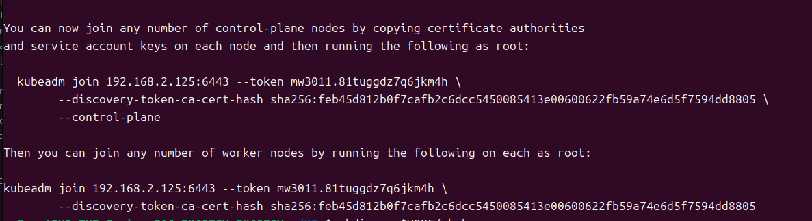

# 生产环境安装kubernetes

## 设备信息

1. 天选5：
    - CPU：
    - 内存：32GB
    - 硬盘：500GB
    - 系统：Ubuntu 24.04
    - 已有环境：docker 27.4.1
    - ip：192.168.2.125

2. 工控机：
    - CPU：
    - 内存：
    - 硬盘：
    - 系统：
    - 已有环境：docker 
    - ip：

以设备一为Master节点，设备二为Node节点。
Master需要安装以下组件：

## 通用步骤

### 1. 禁用swap，加载内核模块
```bash
$ sudo swapoff -a
$ sudo sed -i '/ swap / s/^\(.*\)$/#\1/g' /etc/fstab
```

使用 modprobe 命令加载以下内核模块。
```bash
$ sudo modprobe overlay  # 提供容器分层文件系统支持。
$ sudo modprobe br_netfilter  # 提供容器或虚拟化环境中的网络流量过滤和 NAT 支持。
```

要永久加载这些模块，请创建包含以下内容的文件。
```bash
$ sudo tee /etc/modules-load.d/k8s.conf <<EOF
overlay
br_netfilter
EOF
```
运行以下命令，加载上述内核参数。
```bash
$ sudo sysctl --system
```

### 2. 安装配置 Containerd

Containerd 为 Kubernetes 提供了容器运行时，在所有实例上安装 containerd
```bash
$ sudo apt install -y curl gnupg2 software-properties-common apt-transport-https ca-certificates
```

接下来，使用以下命令添加 containerd 存储库(安装过docker不用重复配置)。
- X86_64架构
```bash
$ sudo curl -fsSL https://download.docker.com/linux/ubuntu/gpg | sudo gpg --dearmour -o /etc/apt/trusted.gpg.d/containerd.gpg
$ sudo add-apt-repository "deb [arch=amd64] https://download.docker.com/linux/ubuntu $(lsb_release -cs) stable"   
```

- ARM64架构（树莓派）
```bash
$ sudo curl -fsSL https://download.docker.com/linux/ubuntu/gpg | sudo gpg --dearmour -o /etc/apt/trusted.gpg.d/containerd.gpg
$ sudo add-apt-repository "deb [arch=arm64] https://download.docker.com/linux/ubuntu $(lsb_release -cs) stable" 
```
上面卡住的话，直接编辑 /etc/apt/sources.list.d/docker.list
```bash
sudo nano /etc/apt/sources.list.d/docker.list

# 添加以下内容
deb [arch=arm64] https://download.docker.com/linux/ubuntu oracular stable
```
更新软件包
```bash
$ sudo apt update
```


现在，使用以下 apt 命令安装 containerd
```bash
$ sudo apt update && sudo apt install containerd.io -y
```

接下来，配置 containerd，使其开始使用 SystemdCgroup 运行下面的命令。
```bash
$ containerd config default | sudo tee /etc/containerd/config.toml >/dev/null 2>&1
$ sudo sed -i 's/SystemdCgroup \= false/SystemdCgroup \= true/g' /etc/containerd/config.toml
```

修改 sandbox_image，把 registry.k8s.io/pause:3.8 改为如下值，官方的pause镜像在国内无法下载。

这里不改的话，后面初始化集群会报错。我也是报错后才回头来改的。

```bash
sudo nano /etc/containerd/config.toml

registry.aliyuncs.com/google_containers/pause:3.10
```

重新启动 containerd 服务，使上述更改生效。
```bash
$ sudo systemctl restart containerd
```

对于非root用户，需要将其添加到 containerd 组中，以便使用 containerd 命令。
```bash
sudo groupadd containerd
sudo usermod -aG containerd $(whoami)
newgrp containerd
```

### 组件安装

使用阿里云的源，安装kubeadm、kubelet、kubectl
```bash
#Debian / Ubuntu - 我用的这个
#下载 Kubernetes 包存储库的公共签名密钥
curl -fsSL https://mirrors.aliyun.com/kubernetes-new/core/stable/v1.31/deb/Release.key | sudo gpg --dearmor -o /etc/apt/keyrings/kubernetes-apt-keyring.gpg
echo "deb [signed-by=/etc/apt/keyrings/kubernetes-apt-keyring.gpg] https://mirrors.aliyun.com/kubernetes-new/core/stable/v1.31/deb/ /" | sudo tee /etc/apt/sources.list.d/kubernetes.list
sudo apt-get update
sudo apt-get install -y kubelet kubeadm kubectl
```

至此，Node节点的安装已经全部完成。

## Master节点初始化及加入Node节点

### 1. 初始化Master节点
初始化配合
```yaml
apiVersion: kubeadm.k8s.io/v1beta4
kind: ClusterConfiguration
kubernetesVersion: 1.31.2
#这里要使用别名，不能用IP
controlPlaneEndpoint: "192.168.2.125"  #这里是Master节点的IP
# 镜像拉取配置
imageRepository: "registry.aliyuncs.com/google_containers"  # 指定镜像源
```

初始化命令
```bash
sudo kubeadm init --config=kubeadm-config.yaml
```
初始化完成后，会有一些提示信息，如下图所示：

在节点执行图中命令可以加入集群

### 2. 安装calico网络插件
使用calico_yaml文件夹下的calico-v3.28.1.yaml文件
```bash
kubectl create -f calico-v3.28.1.yaml
```

### 3. 加入Node节点

设置IP转发
```bash
sudo sysctl net.ipv4.ip_forward=1
```
永久生效
```bash
sudo nano /etc/sysctl.conf
#添加以下内容
net.ipv4.ip_forward=1
```

加入Node节点，使用Master节点初始化时的命令

### 4. 查看节点状态
查看节点状态
```bash
kubectl get nodes
```
应该会在calico网络插件安装完成1~2分钟后，看到节点状态为Ready

# 重新部署 Kubernetes 集群

如果需要**重新部署 Kubernetes 集群**，以下是简化的步骤：  

---

## **1. 清理旧集群配置**  

### **步骤 1.1：重置集群**  
在所有节点上运行以下命令：  
```bash
sudo kubeadm reset
```

- 输入 **`y`** 确认。  
- 该命令会清除 Kubernetes 配置文件和组件，但不会删除网络插件。  

### **步骤 1.2：删除残留数据**  
```bash
sudo rm -rf ~/.kube
sudo rm -rf /etc/kubernetes/
sudo rm -rf /var/lib/etcd/
sudo rm -rf /var/lib/cni/
sudo rm -rf /var/run/kubernetes/
sudo iptables -F && sudo iptables -X
sudo iptables -t nat -F && sudo iptables -t nat -X
sudo iptables -t raw -F && sudo iptables -t raw -X
sudo iptables -t mangle -F && sudo iptables -t mangle -X
```

### **步骤 1.3：重启 kubelet 和 docker**  
```bash
sudo systemctl restart kubelet
sudo systemctl restart docker
```

---

## **2. 重新初始化控制平面节点**  

### **步骤 2.1：初始化 Kubernetes**  
假设控制平面新的 IP 地址为 `192.168.1.100`，pod 子网为 `10.10.0.0/16`：  
```bash
sudo kubeadm init --control-plane-endpoint "192.168.1.100:6443" --pod-network-cidr=10.10.0.0/16
```

**说明**：  
- `--control-plane-endpoint`：指定控制平面的 IP 地址或主机名。  
- `--pod-network-cidr`：定义 Pod 网络子网。  

---

### **步骤 2.2：配置 kubectl**  
```bash
mkdir -p $HOME/.kube
sudo cp -i /etc/kubernetes/admin.conf $HOME/.kube/config
sudo chown $(id -u):$(id -g) $HOME/.kube/config
```

---

### **步骤 2.3：部署网络插件**  
使用 Flannel 网络插件：  
```bash
kubectl apply -f https://raw.githubusercontent.com/coreos/flannel/master/Documentation/kube-flannel.yml
```

---

## **3. 加入工作节点**  

### **步骤 3.1：生成加入命令**  
在控制平面节点上运行：  
```bash
kubeadm token create --print-join-command
```

### **步骤 3.2：执行加入命令**  
在工作节点上运行生成的命令，例如：  
```bash
sudo kubeadm join 192.168.1.100:6443 --token <token> --discovery-token-ca-cert-hash sha256:<hash>
```

---

## **4. 验证集群状态**  

### **步骤 4.1：查看节点状态**  
```bash
kubectl get nodes
```

### **步骤 4.2：查看 Pod 状态**  
```bash
kubectl get pods -A
```

---

## **总结**  
这种方法会重新初始化 Kubernetes 集群，并清理旧配置，适合 IP 地址、网络配置等发生变化的场景。如果希望避免复杂的配置修改，这是更快捷的解决方案。


# 工作节点重新加入集群

禁用swap
```bash
sudo swapoff -a
sudo sed -i '/ swap / s/^\(.*\)$/#\1/g' /etc/fstab
```

清除之前执行的 kubeadm join 配置，并恢复系统到初始状态清除之前执行的 kubeadm join 配置，并恢复系统到初始状态
```bash
sudo kubeadm reset
```

清理残留的文件和配置
```bash
sudo rm -rf /etc/kubernetes/
sudo rm -rf /var/lib/etcd/
sudo rm -rf /var/lib/cni/
sudo rm -rf /var/run/kubernetes/
sudo rm -rf /var/lib/kubelet/*
sudo rm -rf /etc/cni/
```
