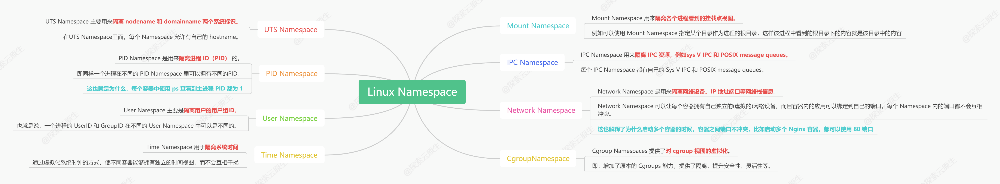
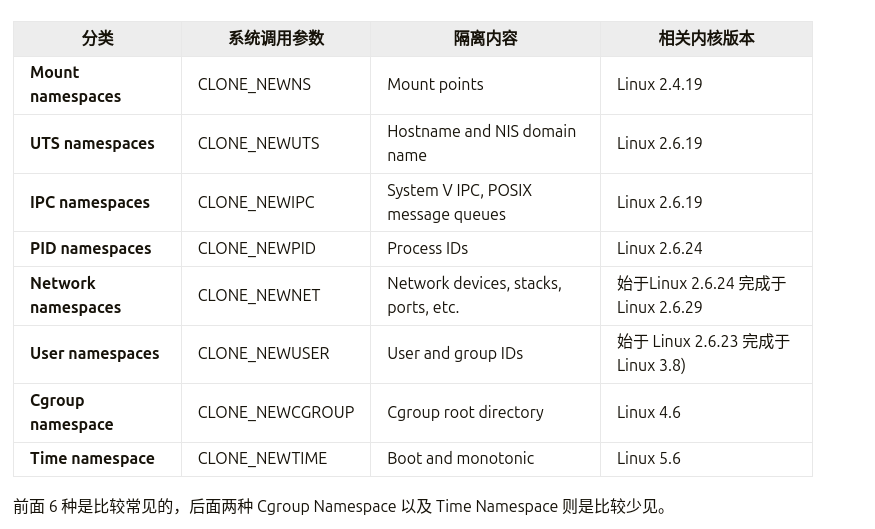
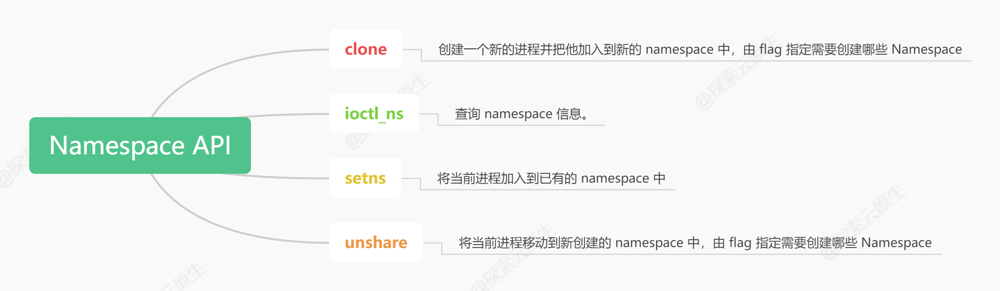

# 探索 Linux Namespace：Docker 隔离的神奇背后

文章来源：[探索 Linux Namespace：Docker 隔离的神奇背后](https://www.lixueduan.com/posts/docker/05-namespace/)



## 1. 什么是Linux命名空间（Namespace）?

**Namespace 是 Linux 提供的一种内核级别环境隔离的方法。**

可以使得处于不同 namespace 的进程拥有独立的全局系统资源，改变一个 namespace 中的系统资源只会影响当前 namespace 里的进程，对其他 
namespace 中的进程没有影响。

**简单来说：namespace 就是对资源的逻辑隔离**



### 相关API

和 namespace 相关的函数只有四个，这里简单的看一下：



* clone
* setns
* unshare
* ioctl_ns

clone：创建一个新的进程并把他放到新的 namespace 中。
```c
int clone(int (*fn)(void *), void *stack, int flags, void *arg, ...
                 /* pid_t *parent_tid, void *tls, pid_t *child_tid */ );
 /*
 flags：
    指定一个或者多个上面的CLONE_NEW*（当然也可以包含跟namespace无关的flags）， 
    这样就会创建一个或多个新的不同类型的namespace， 
    并把新创建的子进程加入新创建的这些namespace中。
 */
```

setns：将当前进程加入到已有的 namespace 中。
```c
int setns(int fd, int nstype);
/*
fd：
    指向/proc/[pid]/ns/目录里相应namespace对应的文件，
    表示要加入哪个namespace
nstype：
    指定namespace的类型（上面的任意一个CLONE_NEW*）：
    1. 如果当前进程不能根据fd得到它的类型，如fd由其他进程创建，
    并通过UNIX domain socket传给当前进程，
    那么就需要通过nstype来指定fd指向的namespace的类型
    2. 如果进程能根据fd得到namespace类型，比如这个fd是由当前进程打开的，
    那么nstype设置为0即可
*/
```

unshare：使当前进程退出指定类型的 namespace，并加入到新创建的 namespace（相当于创建并加入新的 namespace）。
```c
int unshare(int flags);
/*
flags：
    指定一个或者多个上面的CLONE_NEW*，
    这样当前进程就退出了当前指定类型的namespace并加入到新创建的namespace
*/
```

ioctl_ns：查询 namespace 信息。
```c
new_fd = ioctl(fd, request);
/*
fd: 指向/proc/[pid]/ns/目录里相应namespace对应的文件
request: 
  NS_GET_USERNS: 返回指向拥有用户的文件描述符namespace fd引用的命名空间
    NS_GET_PARENT: 返回引用父级的文件描述符由fd引用的命名空间的命名空间。
*/
```

看完之后大致可以这样分类：

- clone、unshare：加入新 namespace
- setsns：加入已有 namespace
- ioctl_ns：主要用于查询

**clone 和 unshare 都是加入新 namespace，二者有什么区别呢？**

二者的功能都是创建并加入新的 namespace， 区别在于:
- unshare 是使 当前进程 加入新的 namespace
- clone 是创建一个新的子进程，然后让 子进程 加入新的 namespace，而当前进程保持不变

### 查看进程所属的 namespaces
系统中的每个进程都有 /proc/[pid]/ns/ 这样一个目录，里面包含了这个进程所属 namespace 的信息，里面每个文件的描述符都可以用来作为 setns 函数(后面会介绍)的参数。

```shell
ls -l /proc/$$/ns/
总计 0
lrwxrwxrwx 1 zs zs 0 10月 17 20:28 cgroup -> 'cgroup:[4026531835]'
lrwxrwxrwx 1 zs zs 0 10月 17 20:28 ipc -> 'ipc:[4026531839]'
lrwxrwxrwx 1 zs zs 0 10月 17 20:28 mnt -> 'mnt:[4026531841]'
lrwxrwxrwx 1 zs zs 0 10月 17 20:28 net -> 'net:[4026531840]'
lrwxrwxrwx 1 zs zs 0 10月 17 20:28 pid -> 'pid:[4026531836]'
lrwxrwxrwx 1 zs zs 0 10月 17 20:28 pid_for_children -> 'pid:[4026531836]'
lrwxrwxrwx 1 zs zs 0 10月 17 20:28 time -> 'time:[4026531834]'
lrwxrwxrwx 1 zs zs 0 10月 17 20:28 time_for_children -> 'time:[4026531834]'
lrwxrwxrwx 1 zs zs 0 10月 17 20:28 user -> 'user:[4026531837]'
lrwxrwxrwx 1 zs zs 0 10月 17 20:28 uts -> 'uts:[4026531838]'
```

以ipc:[4026531839]为例，其中 ipc 是 namespace 的类型，4026531839 是 inode number。

如果两个进程的 ipc namespace 的 inode number一样，说明他们属于同一个 namespace。

### namespace 数量限制与回收策略

linux 也限制了 namespace 的数量，不能无限制的创建 namespace，具体限制一般在 /proc/sys/user 目录中。具体如下：
```shell
$ tree /proc/sys/user
/proc/sys/user
├── max_cgroup_namespaces
├── max_fanotify_groups
├── max_fanotify_marks
├── max_inotify_instances
├── max_inotify_watches
├── max_ipc_namespaces
├── max_mnt_namespaces
├── max_net_namespaces
├── max_pid_namespaces
├── max_time_namespaces
├── max_user_namespaces
└── max_uts_namespaces

1 directory, 12 files

$ cat /proc/sys/user/max_pid_namespaces 
126524

```

可以看到，当前系统中 PID namespace 最多可以创建 126524 个。
**既然数量有限制，那已经创建的 namespace 什么时候会被销毁回收呢？**

规则还是比较好理解的：当一个 namespace 中的所有进程都结束或者移出该 namespace 时，该 namespace 将会被销毁。

这也解释了为什么没有创建 namespace 的 API，因为刚创建的 namespace 没有任何进程，立马就会被回收。

不过也有一些特殊情况，可以再没有进程的时候保留 namespace：
- 存在打开的 FD，或者对 /proc/[pid]/ns/* 执行了 bind mount
- 存在子 namespace
- 它是一个拥有一个或多个非用户 namespace 的 namespace。
- 它是一个 PID namespace，并且有一个进程通过 /proc/[pid]/ns/pid_for_children 符号链接引用了这个 namespace。
- 它是一个 Time namespace，并且有一个进程通过 /proc/[pid]/ns/time_for_children 符号链接引用了这个 namespace。
- 它是一个 IPC namespace，并且有一个 mqueue 文件系统的 mount 引用了该 namespace
- 它是一个 PIDnamespace，并且有一个 proc 文件系统的 mount 引用了该 namespace

一句话描述：**当 namespace 有被使用时就不会被回收，反之则会被回收**。

## 2. 使用go语言操作Linux命名空间

### UTS Namespace

UTS Namespace主要用来隔离nodename和domainname两个系统标识。

在UTS Namespace里面，每个Namespace允许有自己的hostname.

以下程序展示了如何在 Go 中切换 UTS Namespace。

```go
// 注: 运行时需要 root 权限。
func main() {
	cmd := exec.Command("bash")
	cmd.SysProcAttr = &syscall.SysProcAttr{
		Cloneflags: syscall.CLONE_NEWUTS,
	}

	cmd.Stdin = os.Stdin
	cmd.Stdout = os.Stdout
	cmd.Stderr = os.Stderr

	if err := cmd.Run(); err != nil {
		log.Fatalln(err)
	}
}
```

运行并测试

```shell
go run main.go
```

运行后会进入了一个新的 shell 环境。

查看以下是否真的进入了新的 UTS Namespace。

pstree 是一个用于显示进程树的命令行工具，常用于查看系统上正在运行的进程及其父子关系
- -p: 显示进程的 PID
- -l: 显示进程的完整命令行
- -a: 显示进程的命令行参数
- -u: 显示进程的 UID


首先使用pstree查看进程关系：

```shell
$ pstree -pl
           │               ├─gnome-terminal-(5013)─┬─bash(165006)
           │               │                       ├─bash(167694)───sudo(167760)───sudo(167768)───su(167769)───bash(167770)───go(167929)─┬─main(168109)─┬─bash(168113)───pstree(168282)
           │               │                       │                                                                                     │              ├─{main}(168110)
           │               │                       │                                                                                     │              ├─{main}(168111)
           │               │                       │                                                                                     │              └─{main}(168112)
           │               │                       │                                                                                     ├─{go}(167930)
           │               │                       │                                                                                     ├─{go}(167931)
           │               │                       │                                                                                     ├─{go}(167932)
           │               │                       │                                                                                     ├─{go}(167933)
           │               │                       │                                                                                     ├─{go}(167934)
           │               │                       │                                                                                     ├─{go}(167935)
           │               │                       │                                                                                     ├─{go}(167936)
           │               │                       │                                                                                     ├─{go}(167937)
           │               │                       │                                                                                     ├─{go}(167938)
           │               │                       │                                                                                     ├─{go}(167939)
           │               │                       │                                                                                     ├─{go}(167940)
           │               │                       │                                                                                     ├─{go}(167941)
           │               │                       │                                                                                     ├─{go}(167942)
           │               │                       │                                                                                     ├─{go}(167943)
           │               │                       │                                                                                     ├─{go}(167944)
           │               │                       │                                                                                     ├─{go}(167945)
           │               │                       │                                                                                     ├─{go}(167946)
           │               │                       │                                                                                     ├─{go}(167953)
           │               │                       │                                                                                     ├─{go}(167956)
           │               │                       │                                                                                     ├─{go}(167959)
           │               │                       │                                                                                     ├─{go}(167962)
           │               │                       │                                                                                     ├─{go}(167971)
           │               │                       │                                                                                     ├─{go}(167973)
           │               │                       │                                                                                     ├─{go}(167974)
           │               │                       │                                                                                     ├─{go}(167992)
           │               │                       │                                                                                     ├─{go}(168047)
           │               │                       │                                                                                     ├─{go}(168058)
           │               │                       │                                                                                     ├─{go}(168059)
           │               │                       │                                                                                     ├─{go}(168060)
           │               │                       │                                                                                     ├─{go}(168061)
           │               │                       │                                                                                     ├─{go}(168062)
           │               │                       │                                                                                     └─{go}(168108)
```

主要关注这条：

```shell
├─bash(167694)───sudo(167760)───sudo(167768)───su(167769)───bash(167770)───go(167929)─┬─main(168109)─┬─bash(168113)───pstree(168282)
```

main程序的pid是 168109，后续创建的bash pid是 168113，pstree的pid是 168282。

查看uts

```shell
$ ls -l /proc/168109/ns/uts
lrwxrwxrwx 1 root root 0 10月 18 21:43 /proc/168109/ns/uts -> 'uts:[4026531838]'
$ ls -l /proc/168113/ns/uts
lrwxrwxrwx 1 root root 0 10月 18 21:43 /proc/168113/ns/uts -> 'uts:[4026534073]'
```
可以发现二者确实不在一个 UTS Namespace 中。由于 UTS Namespace hostname 做了隔离 所以在这个环境内修改 hostname 应该不影响外部主机， 下面来做 下实验。

在这个新的 bash 环境中修改 hostname
```shell
$ hostname bash
$ hostname
bash
```
新开一个在宿主机上查看 hostname：
```shell
$ hostname
zs-ASUS-TUF-Gaming-F16-FX607JV-FX607JV
```
可以看到外部的 hostname 并没有被修改影响，由此可了解 UTS Namespace 的作用。

### IPC Namespace(IPC, Inter-Process Communication) 

IPC Namespace 用来隔离 sys V IPC 和 POSIX message queues。

- SysV IPC (System V Inter-Process Communication)

    SysV IPC 是一套源自 Unix System V 的 IPC 机制，主要包括三种通信方式
    - 消息队列（Message Queue）：提供基于消息的进程间通信，消息以队列的形式存储，进程可以异步地向队列发送和接受消息
    - 信号量（Semaphore）：提供对共享资源的同步访问控制。信号量通常用于解决多个进程访问共享资源时的竞态条件问题。
    - 共享内存（Shared Memory）：提供进程间共享内存区的机制，使得多个进程可以访问同一块内存空间，从而实现快速的进程间通信。

    特点：
    - 持久化标识符：创建 IPC 对象（如消息队列、共享内存等）时，会返回一个持久的标识符，直到显式删除为止。即使进程退出，IPC 对象也不会自动销毁，需要手动清理。
    - 全局命名空间：IPC 对象通过键值标识，这个键在系统中是全局唯一的。

- POSIX Message Queues (POSIX消息队列)

    POSIX message queues 是符合 POSIX 标准的消息队列 IPC 机制，提供了一种消息为单位的进程间通信方式。它与 SysV 消息队列有相似的用途，但设计更加现代化，API 更加一致。

    特点：
    - **基于文件描述符**：POSIX message queues 使用类似于文件的接口进行操作，每个消息队列被看作是一个文件描述符，可以通过 mq_open() 函数来打开。
    - **消息优先级**：每条消息可以带有一个优先级。消息队列中的消息按优先级排序，高优先级的消息会优先被接收。
    - **自动清理**：当所有进程关闭消息队列时，队列会自动被销毁，不需要显式清理。
    - **命名空间**：消息队列使用以 / 开头的路径名称来标识，例如 /myqueue。
    - **线程安全**：POSIX 消息队列的 API 更加符合现代操作系统的线程安全需求。

每个 IPC Namespace 都有自己的 Sys V IPC 和 POSIX message queues。

微调一下程序，只是修改了 Cloneflags，新增了 CLONE_NEWIPC，表示同时创建 IPC Namespace。

```go
// 注: 运行时需要 root 权限。
func main() {
	cmd := exec.Command("bash")
	cmd.SysProcAttr = &syscall.SysProcAttr{
		// Cloneflags: syscall.CLONE_NEWUTS,
		Cloneflags: syscall.CLONE_NEWUTS | syscall.CLONE_NEWIPC,
	}

	cmd.Stdin = os.Stdin
	cmd.Stdout = os.Stdout
	cmd.Stderr = os.Stderr

	if err := cmd.Run(); err != nil {
		log.Fatalln(err)
	}
}
```

运行并测试：

```shell
# 先查看宿主机上的 ipc message queue
$ ipcs -q
--------- 消息队列 -----------
键        msqid      拥有者  权限     已用字节数 消息 

# 创建一个
$ ipcmk -Q
消息队列 id：0

# 查看
$ ipcs -q
--------- 消息队列 -----------
键        msqid      拥有者  权限     已用字节数 消息      
0x83557226 0          zs         644        0            0 
```

运行程序进入新的shell
    
```shell
$ go run main.go
$ ipcs -q
--------- 消息队列 -----------
键        msqid      拥有者  权限     已用字节数 消息
```
可以发现，在新的 Namespace 中已经看不到宿主机上的 message queue 了。说明 IPC Namespace 创建成功，IPC 已经被隔离。
在宿主机上也无法看到新的 Namespace 中的 message queue。

### PID Namespace

PID Namespace是用来隔离进程ID的。

同样一个进程在不同的PID Namespace里可以拥有不同的PID。

这样就可以理解，在docker container 里面，使用ps -ef经常会发现，在容器内，前台运行的那个进程PID是1，但是在容器外，使用ps -ef会发现同样的进程却有不同的PID，这就是PID Namespace做的事情。

再次调整程序，增加 PID flags：

```go
// 注: 运行时需要 root 权限。
func main() {
	cmd := exec.Command("bash")
	cmd.SysProcAttr = &syscall.SysProcAttr{
		// Cloneflags: syscall.CLONE_NEWUTS,
		// Cloneflags: syscall.CLONE_NEWUTS | syscall.CLONE_NEWIPC,
		Cloneflags: syscall.CLONE_NEWUTS | syscall.CLONE_NEWIPC | syscall.CLONE_NEWPID,
	}

	cmd.Stdin = os.Stdin
	cmd.Stdout = os.Stdout
	cmd.Stderr = os.Stderr

	if err := cmd.Run(); err != nil {
		log.Fatalln(err)
	}
}
```

运行并测试：

```shell
├─gnome-terminal-(223467)─┬─bash(223480)───sudo(223487)───sudo(223488)───su(223489)───bash(223490)───go(224979)─┬─main(225168)─┬─bash(225173)───pstree(225189)
           │               │                         │                                                                                     │              ├─{main}(225169)
           │               │                         │                                                                                     │              ├─{main}(225170)
           │               │                         │                                                                                     │              ├─{main}(225171)
           │               │                         │                                                                                     │              └─{main}(225172)
           │               │                         │                                                                                     ├─{go}(224980)
           │               │                         │                                                                                     ├─{go}(224981)
           │               │                         │                                                                                     ├─{go}(224982)
           │               │                         │                                                                                     ├─{go}(224983)
           │               │                         │                                                                                     ├─{go}(224984)
           │               │                         │                                                                                     ├─{go}(224985)
           │               │                         │                                                                                     ├─{go}(224986)
           │               │                         │                                                                                     ├─{go}(224987)
           │               │                         │                                                                                     ├─{go}(224988)
           │               │                         │                                                                                     ├─{go}(224989)
           │               │                         │                                                                                     ├─{go}(224990)
           │               │                         │                                                                                     ├─{go}(224991)
           │               │                         │                                                                                     ├─{go}(224992)
           │               │                         │                                                                                     ├─{go}(225003)
           │               │                         │                                                                                     ├─{go}(225004)
           │               │                         │                                                                                     ├─{go}(225005)
           │               │                         │                                                                                     ├─{go}(225006)
           │               │                         │                                                                                     ├─{go}(225009)
           │               │                         │                                                                                     ├─{go}(225011)
           │               │                         │                                                                                     ├─{go}(225017)
           │               │                         │                                                                                     ├─{go}(225052)
           │               │                         │                                                                                     ├─{go}(225064)
           │               │                         │                                                                                     ├─{go}(225073)
           │               │                         │                                                                                     ├─{go}(225078)
           │               │                         │                                                                                     ├─{go}(225084)
           │               │                         │                                                                                     ├─{go}(225089)
           │               │                         │                                                                                     ├─{go}(225094)
           │               │                         │                                                                                     ├─{go}(225096)
           │               │                         │                                                                                     ├─{go}(225100)
           │               │                         │                                                                                     ├─{go}(225101)
           │               │                         │                                                                                     ├─{go}(225107)
           │               │                         │                                                                                     ├─{go}(225109)
           │               │                         │                                                                                     ├─{go}(225112)
           │               │                         │                                                                                     └─{go}(225167)
```

可以看到main函数pid为225168，新开的bash pid为225173
然后在新的bash环境中查看pid

```shell
$ ls -l /proc/225168/ns/pid
lrwxrwxrwx 1 root root 0 10月 20 10:09 /proc/225168/ns/pid -> 'pid:[4026531836]'

$ ls -l /proc/225173/ns/pid
lrwxrwxrwx 1 root root 0 10月 20 10:09 /proc/225173/ns/pid -> 'pid:[4026534079]'

$ echo $$
1
```

发现 pid 是1，说明再新开的 PID Namespace 中只有一个 bash 这个进程，而且被伪装成了 1 号进程。

### Mount Namespace

**Mount Namespace用来隔离各个进程看到的挂载点视图**

在不同Namespace的进程中，看到的文件系统层次是不一样的。 在Mount Namespace中调用mount()和umount()仅仅只会影响当前Namespace内的文件系统，而对全局的文件系统是没有影响的。

看到这里，也许就会想到chroot()，它也是将某一个子目录变成根节点。但是，Mount Namespace不仅能实现这个功能，而且能以更加灵活和安全的方式实现。

需要注意的是，Mount Namespace 的 flag 是CLONE_NEWNS,直接是 NEWNS 而不是 NEWMOUNT,因为 Mount Namespace 是 Linux 中实现的第一个 Namespace，当时也没想到后续会有很多类型的 Namespace 加入。

再次修改代码，增加 Mount Namespace 的 flag

运行并测试：

首先运行程序并在新的 bash 环境中查看 /proc

```shell
$ ls /proc
1      1293    166828  208     223986  226940  293   3523   387    5197   65     879         devices
100    13      167     208043  223996  226944  3     3525   388    52     66     88          diskstats
10016  130     168     208046  224     226945  30    3534   389    5204   68     881         dma
101    130457  17      209     224018  226951  3019  3550   3896   5253   6835   882         driver
102    130505  170     21      224069  227     3024  3566   39     5273   688    883         dynamic_debug
104    131     171     210605  224344  228     3031  3583   390    5277   689    884         execdomains
10403  131410  172     210872  224427  229     3040  35881  391    5280   69     885         fb
105    132     173     210966  224463  23      3041  35882  392    5283   690    886         filesystems
1051   134     173269  212172  224553  230     3055  35886  393    53     692    887         fs
106    135     174     213129  224799  232     3063  35887  394    54     69781  888         interrupts
1062   135685  174100  214     224961  233     3066  35888  395    541    7      889         iomem
10690  136     174458  214705  224979  234     3110  35889  396    5427   70     88997       ioports
10691  137     176     215     225     235     317   35890  397    5483   70025  89          irq
107    138     177     217     225168  236     32    35891  4      5488   70047  890         kallsyms
10728  14      178     217481  225173  237     3200  35892  40     5489   70120  891         kcore
1077   140     1781    218     225193  238     3203  35893  41     5491   70151  896         keys
108    141     179     219     225324  239     322   35894  4119   550    70171  897         key-users
110    142     18      219503  225337  24      3234  35895  4147   5511   70345  898         kmsg
111    1421    180     219507  225387  240     3242  35896  4187   5526   71     8990        kpagecgroup
112    142580  182     219552  225428  2404    3249  35897  42     5530   72     9           kpagecount
113    143     1829    22      225486  2406    3254  35898  4247   5545   74     90          kpageflags
11332  144     183     220     225492  2409    3262  35899  4339   555    75     915         latency_stats
114    146     184     220035  225650  241     3266  35900  438    56     757    92          loadavg
1152   147     185     220160  225729  242     3267  35901  439    5625   76     922         locks
1153   148     186     221     225837  243     3268  35902  44     56873  7606   923         mdstat
1154   149     188     221346  225839  244     3269  35903  444    57     77     924         meminfo
1158   15      189     221864  225861  246     3270  35904  445    5752   78     9246        misc
116    150     19      221913  225926  247     3272  35905  447    5767   7920   93          modules
1165   152     190     222     225927  251     3281  35906  45     57989  80     931         mounts
1167   153     190049  222400  225953  252     3283  35907  451    58     8088   939         mtd
117    154     190388  222467  225963  253     3288  35908  45280  58039  81     94          mtrr
1175   155     1907    222965  226     26      3292  35909  453    58099  82     940         net
118    156     191     222981  226043  261     3297  35910  454    58207  8250   941         pagetypeinfo
1180   158     192     223     226045  2632    3299  35911  455    58334  8257   94856       partitions
1182   158975  192230  223061  226060  268     33    35912  456    58358  8258   95          pressure
1184   158996  194     223126  226073  2684    3303  35913  46     58369  8260   950         schedstat
1186   159     194359  223133  226096  2688    3304  35914  463    58470  8262   951         scsi
1187   16      194897  223141  226103  2697    3307  35915  4633   58538  8268   952         self
1188   160     195     223188  226109  2698    3354  35916  4686   59     8269   953         slabinfo
119    1603    196     223460  226110  27      3359  35917  47     6      8271   9580        softirqs
1197   1604    197     223463  226123  2700    3362  35918  48     60     8297   96          stat
12     1605    198     223467  226175  2702    34    35919  4818   60304  83     98          swaps
120    161     198795  223480  226201  2704    3414  36     4878   60790  8302   99          sys
122    1613    2       223487  226230  2713    3437  3615   4927   60807  8312   9974        sysrq-trigger
123    1619    20      223488  226237  2740    3440  3645   497    61071  84     acpi        sysvipc
1235   162     200     223489  226624  275     3449  3675   5      61743  842    asound      thread-self
124    1623    201     223490  226637  2751    3454  3680   50     62     8467   bootconfig  timer_list
125    164     202     223791  226647  2759    346   3705   500    63     86     buddyinfo   tty
1258   165     203     223823  226677  28      347   3776   501    630    87     bus         uptime
1259   165630  2038    223826  226698  2815    3470  38     5036   6337   874    cgroups     version
126    165720  204     223831  226887  2822    3495  383    5065   6349   875    cmdline     version_signature
128    165732  205638  223938  226892  2892    35    384    51     636    876    consoles    vmallocinfo
129    166     206     223959  226907  29      3500  385    5160   63725  877    cpuinfo     vmstat
1292   166479  207     223968  226912  2912    3509  386    517    64     878    crypto      zoneinfo
```

可以看到，有一大堆文件，这是因为现在查看到的其实是宿主机上的 /proc 目录。

现在把 proc 目录挂载到当前 Namespace 中来：

```shell
$ mount -t proc proc /proc
$ ls /proc
1           consoles       fb           keys           mdstat        partitions  sys                vmallocinfo
10          cpuinfo        filesystems  key-users      meminfo       pressure    sysrq-trigger      vmstat
acpi        crypto         fs           kmsg           misc          schedstat   sysvipc            zoneinfo
asound      devices        interrupts   kpagecgroup    modules       scsi        thread-self
bootconfig  diskstats      iomem        kpagecount     mounts        self        timer_list
buddyinfo   dma            ioports      kpageflags     mtd           slabinfo    tty
bus         driver         irq          latency_stats  mtrr          softirqs    uptime
cgroups     dynamic_debug  kallsyms     loadavg        net           stat        version
cmdline     execdomains    kcore        locks          pagetypeinfo  swaps       version_signature
```

可以看到，少了一些文件，少的主要是数字命名的目录，因为当前 Namespace 下没有这些进程，自然就看不到对应的信息了。

此时就可以通过 ps 命令来查看了：
```shell
$ ps -ef
UID          PID    PPID  C STIME TTY          TIME CMD
root           1       0  0 10:40 pts/2    00:00:00 bash
root          11       1  0 10:45 pts/2    00:00:00 ps -ef

```

可以看到，在当前 Namespace 中 bash 为 1 号进程。

这就说明，当前 Mount Namespace 中的 mount 和外部是隔离的，mount 操作并没有影响到外部，Docker volume 也是利用了这个特性。

### User Namespace

User Narespace 主要是隔离用户的用户组ID。

也就是说，一个进程的 UserID 和GroupID 在不同的 User Namespace 中可以是不同的。

比较常用的是，在宿主机上以一个非 root 用户运行创建一个 User Namespace, 然后在 User Namespace 里面却映射成 root 用户。这意味着，这个进程在 User Namespace 里面有 root 权限，但是在 User Namespace 外面却没有 root 的权限。

再次修改代码，增加 User Namespace 的 flag：

运行并测试：

首先在宿主机上查看一个 user 和 group：

```shell
# 查看当前用户
$ id
uid=1000(zs) gid=1000(zs) 组=1000(zs),4(adm),24(cdrom),27(sudo),30(dip),46(plugdev),100(users),114(lpadmin),984(docker)

# root用户
uid=0(root) gid=0(root) 组=0(root)
```

可以看到，此时是 root 用户。

运行程序，进入新的 bash 环境：

```shell
$ id
uid=65534(nobody) gid=65534(nogroup) 组=65534(nogroup)
```

可以看到，UID 是不同的，说明 User Namespace 生效了。

### Network Namespace

Network Namespace 是用来隔离网络设备、IP 地址端口等网络栈的 Namespace。

Network Namespace 可以让每个容器拥有自己独立的(虛拟的)网络设备，而且容器内的应用可以绑定到自己的端口，每个 Namespace 内的端口都不会互相冲突。

在宿主机上搭建网桥后，就能很方便地实现容器之间的通信，而且不同容器上的应用可以使用相同的端口。

再次修改代码，增加 Network Namespace 的 flag：

运行并测试：

首先看一下宿主机上的网络设备：
```shell
$ ip addr
1: lo: <LOOPBACK,UP,LOWER_UP> mtu 65536 qdisc noqueue state UNKNOWN group default qlen 1000
    link/loopback 00:00:00:00:00:00 brd 00:00:00:00:00:00
    inet 127.0.0.1/8 scope host lo
       valid_lft forever preferred_lft forever
    inet6 ::1/128 scope host noprefixroute 
       valid_lft forever preferred_lft forever
2: enp108s0: <NO-CARRIER,BROADCAST,MULTICAST,UP> mtu 1500 qdisc pfifo_fast state DOWN group default qlen 1000
    link/ether cc:28:aa:ba:3d:88 brd ff:ff:ff:ff:ff:ff
3: wlo1: <BROADCAST,MULTICAST,UP,LOWER_UP> mtu 1500 qdisc noqueue state UP group default qlen 1000
    link/ether e8:b0:c5:20:35:82 brd ff:ff:ff:ff:ff:ff
    altname wlp0s20f3
    inet 10.181.138.253/15 brd 10.181.255.255 scope global dynamic noprefixroute wlo1
       valid_lft 22539sec preferred_lft 22539sec
    inet6 2403:d400:1000:12:fcb:582f:8d5c:1642/64 scope global temporary dynamic 
       valid_lft 551098sec preferred_lft 32581sec
    inet6 2403:d400:1000:12:1989:dbe7:7bec:7095/64 scope global temporary deprecated dynamic 
       valid_lft 464817sec preferred_lft 0sec
    inet6 2403:d400:1000:12:9a3e:5009:b274:49fe/64 scope global temporary deprecated dynamic 
       valid_lft 378537sec preferred_lft 0sec
    inet6 2403:d400:1000:12:39db:d77a:39c3:5f00/64 scope global temporary deprecated dynamic 
       valid_lft 292256sec preferred_lft 0sec
    inet6 2403:d400:1000:12:3ceb:b80b:e616:b677/64 scope global dynamic mngtmpaddr noprefixroute 
       valid_lft 2592000sec preferred_lft 604800sec
    inet6 fe80::837d:546d:4536:ce2a/64 scope link noprefixroute 
       valid_lft forever preferred_lft forever
4: docker0: <NO-CARRIER,BROADCAST,MULTICAST,UP> mtu 1500 qdisc noqueue state DOWN group default 
    link/ether 02:42:1d:ba:f4:db brd ff:ff:ff:ff:ff:ff
    inet 172.17.0.1/16 brd 172.17.255.255 scope global docker0
       valid_lft forever preferred_lft forever
    inet6 fe80::42:1dff:feba:f4db/64 scope link 
       valid_lft forever preferred_lft forever
```

有6个设备

然后运行程序：

```shell
$ go run main.go
$ ip addr
1: lo: <LOOPBACK> mtu 65536 qdisc noop state DOWN group default qlen 1000
    link/loopback 00:00:00:00:00:00 brd 00:00:00:00:00:00
```

可以发现，新的 Namespace 中只有1个设备了，说明 Network Namespace 生效了。

## 3. 总结

- Docker 使用 namespace 进行隔离。
- Namespace 的本质：**Linux Namespace 是 Linux 提供的一种内核级别环境隔离的方法**，本质就是对全局系统资源的一种封装隔离。
- Namespace 的使用：Namespace API 一共 4个，最常用的就是 clone，而 Go 已经把 clone 调用给封装好了，使用时只需要传入不同参数即可控制创建不同 Namespace。


