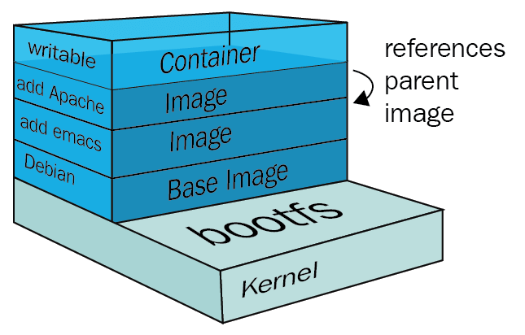
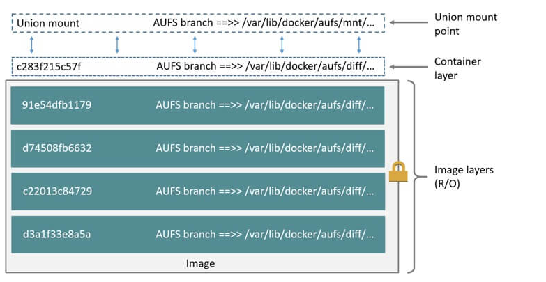

# 深入理解Docker核心原理：Namespace、Cgroups和Rootfs
参考：https://www.lixueduan.com/posts/docker/03-container-core/

容器与进程有和不同
- 进程：进程是操作系统资源分配的基本单位，进程是程序的一次执行过程，程序运行起来后的计算机执行环境总和。即：计算机内存中的数据、寄存器里的值、堆栈中的指令、被打开的文件，以及各种设备的状态信息的一个集合。
- 容器：核心就是通过约束和修改进程的动态表现，从而为其创造出一个“边界”。对于 Docker 等大多数 Linux 容器来说，Cgroups 技术是用来制造约束的主要手段，而 Namespace 技术则是用来修改进程视图的主要方法。

## 1. 基于 Namespace 的隔离
当我们通过 docker run -it 启动并进入一个容器之后，会发现不论是进程、网络还是文件系统，好像都被隔离了,就像这样:
```
docker run -it busybox
Unable to find image 'busybox:latest' locally
latest: Pulling from library/busybox
a46fbb00284b: Pull complete 
Digest: sha256:768e5c6f5cb6db0794eec98dc7a967f40631746c32232b78a3105fb946f3ab83
Status: Downloaded newer image for busybox:latest
/ # ps
PID   USER     TIME  COMMAND
    1 root      0:00 sh
    7 root      0:00 ps
/ # ip a
1: lo: <LOOPBACK,UP,LOWER_UP> mtu 65536 qdisc noqueue qlen 1000
    link/loopback 00:00:00:00:00:00 brd 00:00:00:00:00:00
    inet 127.0.0.1/8 scope host lo
       valid_lft forever preferred_lft forever
    inet6 ::1/128 scope host 
       valid_lft forever preferred_lft forever
5: eth0@if6: <BROADCAST,MULTICAST,UP,LOWER_UP,M-DOWN> mtu 1500 qdisc noqueue 
    link/ether 02:42:ac:11:00:02 brd ff:ff:ff:ff:ff:ff
    inet 172.17.0.2/16 brd 172.17.255.255 scope global eth0
       valid_lft forever preferred_lft forever
/ # ls
bin    etc    lib    proc   sys    usr
dev    home   lib64  root   tmp    var

```
- ps命令看不到宿主机上的进程
- ip命令只能看到容器内的网络设备
- ls命令只能看到容器内的文件系统

**这就是 Docker 核心之一，借助 Linux Namespace 技术实现了视图隔离。**

*看起来容器和宿主机隔离开了*

在 Linux 下可以根据隔离的属性不同分为不同的 Namespace ：

1. PID Namespace
2. Mount Namespace
3. UTS Namespace
4. IPC Namespace
5. Network Namespace
6. User Namespace

通过不同类型的 Namespace 就可以实现不同资源的隔离，比如前面通过 ip a 只能看到容器中的网卡信息，就是通过 Network Namespace进行了隔离。

不过 Linux Namespace 技术实际上修改了应用进程看待整个计算机“视图”，即它的“视线”被操作系统做了限制，只能“看到”某些指定的内容。

我们只需要进入到对应 namespace 就可以突破这个隔离了,演示一下：

首先启动一个 busybox，然后使用 ip a 查看网卡信息
```
docker run -it busybox
/ # ip a show eth0
5: eth0@if6: <BROADCAST,MULTICAST,UP,LOWER_UP,M-DOWN> mtu 1500 qdisc noqueue 
    link/ether 02:42:ac:11:00:02 brd ff:ff:ff:ff:ff:ff
    inet 172.17.0.2/16 brd 172.17.255.255 scope global eth0
       valid_lft forever preferred_lft forever
```

容器中 ip 为 172.17.0.2

然后在新终端中通过 nsenter 进入到该容器 network namespace 试试:

首先通过 docker inspect 命令找到容器对应的 PID
```
docker ps
CONTAINER ID   IMAGE     COMMAND   CREATED          STATUS          PORTS     NAMES
67fd35420a3b   busybox   "sh"      16 minutes ago   Up 16 minutes             loving_sutherland

docker inspect -f '{{.State.Pid}}' 67fd35420a3b
62188
```

然后使用 nsenter --net 命令进入该 PID 对应进程的 network namespace
```
sudo nsenter --target 62188 --net
[sudo] zs 的密码： 
root@zs-ASUS-TUF-Gaming-F16-FX607JV-FX607JV:/home/zs# ip a show eth0
5: eth0@if6: <BROADCAST,MULTICAST,UP,LOWER_UP> mtu 1500 qdisc noqueue state UP group default 
    link/ether 02:42:ac:11:00:02 brd ff:ff:ff:ff:ff:ff link-netnsid 0
    inet 172.17.0.2/16 brd 172.17.255.255 scope global eth0
       valid_lft forever preferred_lft forever
```
可以看到，此时我们执行 ip a 拿到的信息和在容器中执行是完全一致的。

说明 Docker 确实是使用 namespace 进行隔离的。

这里顺便提一下 Namespace 存在的问题，Namespace 最大的问题就是隔离得不彻底。

- 首先，既然容器只是运行在宿主机上的一种特殊的进程，那么多个容器之间使用的就还是同一个宿主机的操作系统内核。
所以，也出现了像 Firecracker、gVisor、Kata 之类的沙箱容器，不使用共享内核来提升安全性。

- 其次，在 Linux 内核中，有很多资源和对象是不能被 Namespace 化的，最典型的例子就是：时间。
容器中修改了时间，实际修改的是宿主机的时间，会导致所有容器时间都被修改，因为是共享的。

## 2. 基于 Cgroups 的资源限制

## 3. 容器镜像Rootfs
这部分主要解释以下三个问题

1. 为什么在容器中修改了文件宿主机不受影响？
2. 容器中的文件系统是哪儿来的？
3. docker 镜像又是怎么实现的？
**这也是 Docker 的第三个核心功能：容器镜像（rootfs）**，将运行环境打包成镜像，从而避免环境问题导致应用无法运行。

### 1. 文件系统

因为容器中的文件系统经过 Mount Namespace 隔离，所以应该是独立的。
其中 **Mount Namespace 修改的，是容器进程对文件系统“挂载点”的认知**。只有在“挂载”这个操作发生之后，进程的视图才会被改变。而在此之前，新创建的容器会直接继承宿主机的各个挂载点。

不难想到，我们可以在容器进程启动之前重新挂载它的整个根目录“/”。而由于 Mount Namespace 的存在，这个挂载对宿主机不可见，所以容器进程就可以在里面随便折腾了。

Linux 中 chroot 命令（change root file system）就能很方便的完成上述工作。

而 Mount Namespace 正是基于对 chroot 的不断改良才被发明出来的，它也是 Linux 操作系统里的第一个 Namespace。

至此，第一个问题 为什么在容器中修改了文件宿主机不受影响？有答案了，因为**使用 Mount Namespace 隔离了文件系统**。

### 2. rootfs

上文提到 Mount Namespace 会修改容器进程对文件系统挂载点的认知，而**这个挂载在容器根目录上、用来为容器进程提供隔离后执行环境的文件系统**，就是所谓的“容器镜像”。它还有一个更为专业的名字，叫作：rootfs（根文件系统）。

**rootfs 只是一个操作系统所包含的文件、配置和目录，并不包括操作系统内核**。在 Linux 操作系统中，这两部分是分开存放的，操作系统只有在开机启动时才会加载指定版本的内核镜像。




所以说，rootfs 只包括了操作系统的“躯壳”，并没有包括操作系统的“灵魂”。**实际上，同一台机器上的所有容器，都共享宿主机操作系统的内核。**

这也是容器相比于虚拟机的主要缺陷之一：毕竟后者不仅有模拟出来的硬件机器充当沙盒，而且每个沙盒里还运行着一个完整的 Guest OS 给应用随便折腾。

不过，正是**由于 rootfs 的存在，容器才有了一个被反复宣传至今的重要特性：一致性**。由于 rootfs 里打包的不只是应用，而是**整个操作系统的文件和目录**，也就意味着，应用以及它运行所需要的所有依赖，都被封装在了一起。

第二个问题：**容器中的文件系统是哪儿来的？**实际上是我们构建镜像的时候打包进去的，然后容器启动时挂载到了根目录下。

### 3. 镜像层（layer）

Docker 在镜像的设计中，引入了层（layer）的概念。也就是说，用户制作镜像的每一步操作，都会生成一个层，也就是一个增量 rootfs。

**通过引入层（layer）的概念，实现了 rootfs 的复用**。不必每次都重新创建一个 rootfs，而是基于某一层进行修改即可。

Docker 镜像层用到了一种叫做**联合文件系统（Union File System）**的能力。Union File System 也叫 UnionFS，最主要的功能是将多个不同位置的目录联合挂载（union mount）到同一个目录下。

例如将目录 A 和目录 B 挂载到目录 C 下面，这样目录 C 下就包含目录 A 和目录 B 的所有文件。

由于看不到目录 A 和 目标 B 的存在，因此就好像 C 目录就包含这么多文件一样

Docker 镜像分为多个层，然后**使用 UFS 将这多个层挂载到一个目录下面**，这样这个目录就包含了完整的文件了。

UnionFS 在不同系统有各自的实现，所以 Docker 的不同发行版使用的也不一样，可以通过 docker info 查看。常见有 aufs（ubuntu 常用）、overlay2（centos 常用）

就像下图这样：union mount 在最上层，提供了统一的视图，用户看起来好像整个系统只有一层一样，实际上下面包含了很多层。



镜像只包含了静态文件，但是容器会产生实时数据，所以容器的 rootfs 在镜像的基础上增加了**可读写层和 Init 层**。

即容器 rootfs 包括：**只读层（镜像rootfs）+ init 层（容器启动时初始化修改的部分数据） + 可读写层（容器中产生的实时数据）**。

- 只读层（镜像rootfs）

它是这个容器的 rootfs 最下面的几层，即镜像中的所有层的总和，它们的挂载方式都是只读的（ro+wh，即 readonly+whiteout）

- 可读写层（容器中产生的实时数据）

它是这个容器的 rootfs 最上面的一层，它的挂载方式为：rw，即 read write。在没有写入文件之前，这个目录是空的。

而一旦在容器里做了写操作，你修改产生的内容就会以增量的方式出现在这个层中，删除操作实现比较特殊（类似于标记删除）。

AUFS 的 whiteout 的实现是通过在上层的可写的目录下建立对应的 whiteout 隐藏文件来实现的。

比如，你要删除只读层里一个名叫 foo 的文件，那么这个删除操作实际上是在可读写层创建了一个名叫.wh.foo 的文件。这样，当这两个层被联合挂载之后，foo 文件就会被.wh.foo 文件“遮挡”起来，“消失”了。

- Init 层（容器启动时初始化修改的部分数据）

它是一个以“-init”结尾的层，夹在只读层和读写层之间，Init 层是 Docker 项目单独生成的一个内部层，专门用来存放 /etc/hosts、/etc/resolv.conf 等信息。

为什么需要 init 层？

比如 hostname 这样的数据，原本是属于镜像层的一部分，要修改的话只能在可读写层进行修改，但是又不想在 docker commit 的时候把这些信息提交上去，所以使用 init 层来保存这些修改。

可以理解为提交代码的时候一般也不会把各种配置信息一起提交上去。

docker commit 只会提交 只读层和可读写层。

最后一个问题：docker 镜像又是怎么实现的？通过引入 layer 概念进行分层，借助 联合文件系统（Union File System）进行叠加，最终构成了完整的镜像。

这里只是镜像的主要内容，具体怎么把这些内容打包成 image 格式就是 OCI 规范了

## 4. 总结

至此，我们大致清楚了 Docker 容器的实现主要使用了如下 3 个功能：

1）Linux Namespace 的隔离能力
2）Linux Cgroups 的限制能力
3）基于 rootfs 的文件系统


